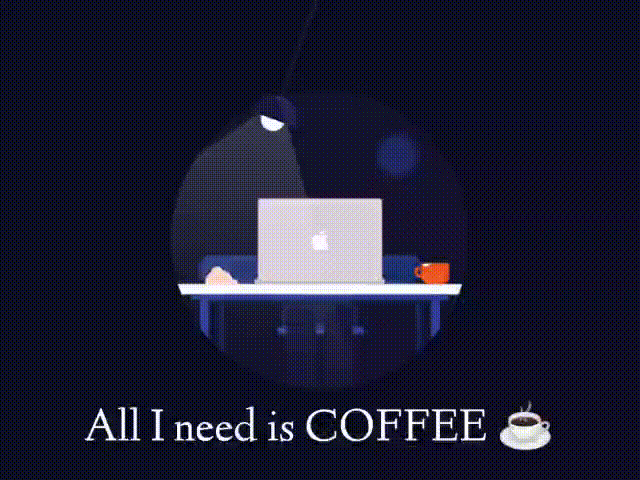

<h1>Hi there , I'm Shubham Mishra</h1>

<code>I'm a Computer Science Engineer. 😎</code>
<code>I love programming. ❤</code>
<code>I like learn new things. 🌱</code>
<code>2022 Goals: Learn more about web3 🥅 </code>
<code>IRON MAN ❤ </code>

---

 

)
## :keyboard: Languages that I've most worked on

### Connect with me:

&nbsp;&nbsp;

&nbsp;&nbsp;

 

